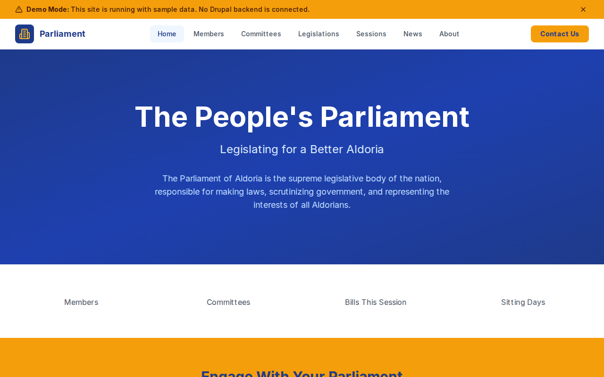

# Decoupled Parliament

A headless Drupal + Next.js starter kit for national legislatures, parliaments, and democratic assemblies. Built for government bodies that need a transparent, accessible website to publish legislation, member profiles, committee work, session schedules, and parliamentary news.



## Features

- **Members of Parliament** -- Profiles with party affiliation, constituency, position, contact details, and photos
- **Committees** -- Standing, select, and joint committees with chairs, meeting schedules, and mandates
- **Legislation** -- Bills and acts with bill numbers, sponsors, status tracking, and committee referrals
- **Sessions** -- Plenary sittings, question time, budget debates, and committee hearings with live broadcast links
- **News** -- Parliamentary press releases, legislative updates, committee reports, and Speaker announcements
- **Homepage** -- Dynamic hero with key stats (members, committees, bills, sitting days) and featured legislation
- **Demo Mode** -- Ships with sample content from a fictional parliament (Parliament of Aldoria) for instant preview

## Quick Start

```bash
# Clone the starter
npx degit nicoschi/decoupled-parliament my-parliament-site
cd my-parliament-site

# Install dependencies
npm install

# Run interactive setup
npm run setup

# Start development
npm run dev
```

Open [http://localhost:3000](http://localhost:3000) to see the demo site.

## Manual Setup

1. **Create a Drupal Space** at [Decoupled](https://app.decoupled.dev)

2. **Import Content** -- Use the DC Import API or MCP tools to import `data/parliament-content.json`. This creates:
   - 3 members: Speaker Eleanor Ashworth, Opposition Leader Marcus Oyelaran, MP Diana Petrov
   - 3 committees: Finance & Economic Affairs, Health & Social Services, Digital Innovation
   - 3 bills: Climate Action Framework Act, Digital Privacy Protection Bill, Education Modernization Act
   - 3 sessions: Plenary Sitting, PM Question Time, Budget Session
   - 3 news articles: Climate bill vote, Speaker procedures, AI in Government report
   - 2 pages: About Parliament, Visiting Parliament

3. **Configure Environment Variables** -- Copy `.env.local.example` to `.env.local` and fill in your Drupal credentials:
   ```
   NEXT_PUBLIC_DRUPAL_BASE_URL=https://your-space.decoupled.website
   DRUPAL_CLIENT_ID=your-client-id
   DRUPAL_CLIENT_SECRET=your-client-secret
   DRUPAL_REVALIDATE_SECRET=your-revalidate-secret
   ```

4. **Generate the GraphQL schema** and start developing:
   ```bash
   npm run generate-schema
   npm run dev
   ```

## Content Types

### Member of Parliament
Elected members of the national legislature.

| Field | Type | Description |
|-------|------|-------------|
| Party | Term (parties) | Political party affiliation |
| Constituency | String | Electoral district represented |
| Position/Title | String | Role (Speaker, Leader of the Opposition, etc.) |
| First Elected | String | Year first elected |
| Email | String | Parliamentary email address |
| Phone | String | Office phone number |
| Photo | Image | Official portrait |

### Committee
Parliamentary committees and subcommittees.

| Field | Type | Description |
|-------|------|-------------|
| Committee Chair | String | Name of the chair |
| Number of Members | Integer | Committee membership size |
| Committee Type | Term (committee_types) | Standing, select, joint, or subcommittee |
| Meeting Schedule | String | Regular meeting times |
| Image | Image | Committee or hearing photo |

### Legislation
Bills, acts, and legislative proposals.

| Field | Type | Description |
|-------|------|-------------|
| Bill Number | String | Official bill identifier (e.g., HB-2026-042) |
| Sponsor | String | Member who introduced the bill |
| Date Introduced | DateTime | When the bill was tabled |
| Legislation Status | String | Current stage (First Reading, Committee Stage, etc.) |
| Committee Referral | String | Which committee is reviewing the bill |
| Category | Term (legislation_categories) | Finance, healthcare, education, environment, etc. |

### Parliamentary Session
Legislative sessions, debates, and sittings.

| Field | Type | Description |
|-------|------|-------------|
| Session Date | DateTime | Start date and time |
| End Time | DateTime | Expected conclusion |
| Location | String | Where the session takes place |
| Session Type | Term (session_types) | Plenary, question time, budget, emergency debate |
| Agenda URL | String | Link to the order paper |
| Broadcast URL | String | Live stream link |

### News Article
Parliamentary news, press releases, and announcements.

| Field | Type | Description |
|-------|------|-------------|
| Featured Image | Image | Article image |
| Category | Term (news_categories) | Legislative updates, committee reports, Speaker announcements |
| Featured | Boolean | Whether to highlight on the homepage |

### Homepage
Parliament homepage with hero, stats, featured legislation, and public engagement CTA.

### Basic Page
Static content pages (About Parliament, Visiting Parliament, etc.).

## Customization

- **Styling** -- Tailwind CSS configuration in `tailwind.config.js`. The starter uses a blue/amber color palette.
- **Navigation** -- Edit `app/components/Header.tsx` to add or remove nav items.
- **Footer** -- Customize links and contact info in `app/components/HomepageRenderer.tsx`.
- **Taxonomies** -- Parties, committee types, legislation categories, session types, and news categories are all configurable.

## Demo Mode

The starter ships with a `DemoModeBanner` component that displays a banner when running in demo mode. To remove it for production, delete the import and component from `app/layout.tsx`.

## Deployment

Deploy to any platform that supports Next.js:

- **Vercel** -- Zero-config deployment. Set environment variables in the Vercel dashboard.
- **Netlify** -- Use the Next.js adapter.
- **Self-hosted** -- Run `npm run build && npm start`.

## Documentation

- [Decoupled Drupal Docs](https://docs.decoupled.dev)
- [Next.js Documentation](https://nextjs.org/docs)
- [Tailwind CSS](https://tailwindcss.com/docs)

## License

MIT
